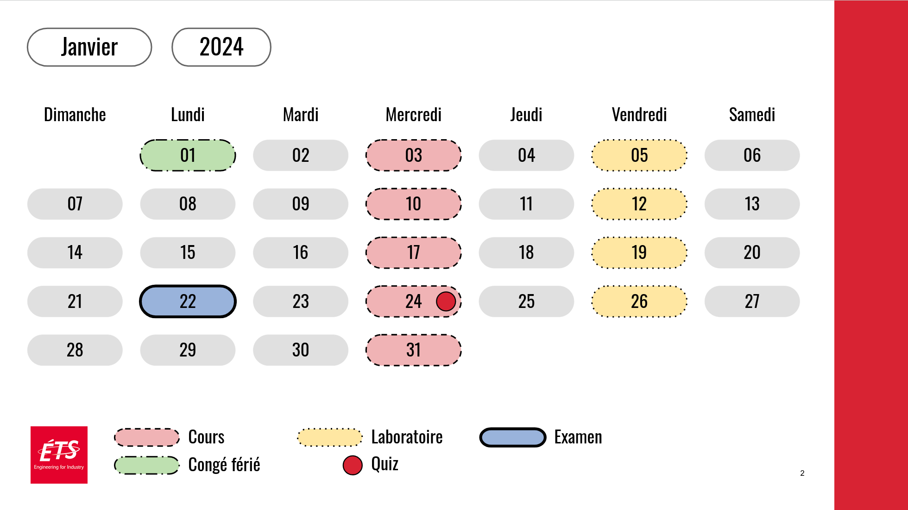

# Semester/Term Calendars Generator

This is an Apps Script project designed and developed at ETS Montreal.

## Overview
The application uses the Google Slides API to generate semester/term calendars 
for the subjects being taught at ETS Montreal. 

## Functionality
1. The application populates a pre-defined Google Slide template with dates and events, 
   creating a visual term calendar.
2. All the generated calendars are Google Slides can be shared, modified, and used in 
   any way that regular Google Slides can be used.

## How To Use
This application is a work-in-progress, and may be converted into an add-on at point.
For now, to use it you need to create a contained Apps Script project linked to your 
Google Slides presentation. You may need need to change the `MainController.js` file to 
adjust the master slide used as template for the calendars:

```javascript
var MasterLayout = {
    TITLE: 1,
    CALENDAR: 0,
    END: 2,
    BLANK: 3
};
```

You may want to use [Google clasp](https://developers.google.com/apps-script/guides/clasp) 
to push the code to your contained Apps Script project. 

### Example of calendar generated with this Apps Script: 



## License
This project is licensed under the terms of the MIT license.

## Authors
Created by Marcos Dias de Assuncao